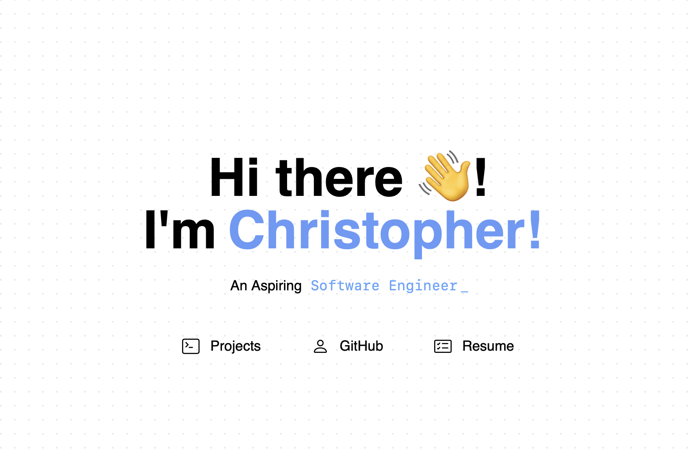

# Chrismena.dev-app



Welcome to the repo showcasing the work and progress for building my own personal portfolio site. Chrismena.dev uses the [NextJS](https://nextjs.org) React Framework, taking advantage of the use of serveless API endpoint.


## Run Locally

Clone the project

```bash
  git clone https://github.com/hexbacon/chrismena.dev-app.git
```

Go to the project directory

```bash
  cd my-project
```

Install dependencies

```bash
  npm install
```

Start the server

```bash
  npm run dev

```

## Authors

- Insipired by [@nuro](https://github.com/nurodev)

- [@hexbacon](https://github.com/hexbacon)

